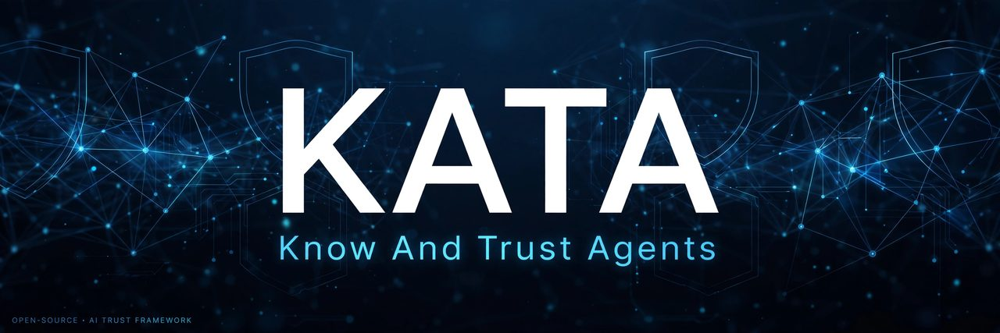
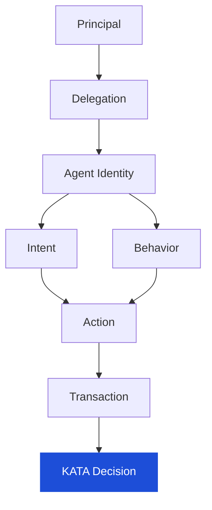
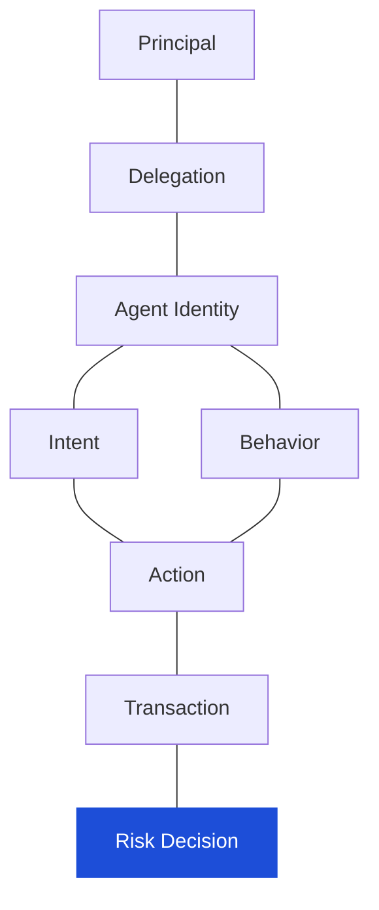

<div align="center">



[](KATA.md)
[](LICENSE)
[](https://github.com/kaanuluer/KATA/pulls)

# KATA

## Know And Trust Agents

> **KATA is a framework for knowing who an AI agent is, who authorized it, what it was intended to do, how it is behaving, and whether the action it is about to take should be trusted.**

</div>

---

## Why KATA exists

Traditional digital systems assume a simple chain:

```
Human → Authentication → Authorization → Transaction
```

They ask: *"Is this user authenticated?"* Then: *"Is this user authorized?"*

In an agentic world, that model breaks. A human authenticates — and then an **AI agent** acts on their behalf. Consider:

> You tell an assistant: **"Book me a flight to Toronto next weekend for less than CAD 500."**

The agent may search airlines, compare prices, enter passenger details, use your payment method, purchase the ticket, and modify the booking. Every one of those steps is an action you didn't directly take.

The question is no longer just *"Is the user authenticated?"*

It becomes:

> **"Is this agent authorized to perform this specific action, and does the action match the user's original intent?"**

KATA is an open framework for answering exactly that.

## The four fundamental questions

KATA is built on four questions that traditional auth never asks:

| # | Question | What it verifies |
|---|----------|------------------|
| 1 | **WHO** is the agent? | Identity and provenance of the agent |
| 2 | **WHO** authorized the agent? | The principal↔agent delegation relationship |
| 3 | **WHAT** was the agent authorized to do? | Original intent, scope, limits, constraints |
| 4 | **IS THE AGENT** behaving consistently with that authorization? | Behavior and action vs. declared intent |

## Core trust model



Each layer adds context. KATA never makes a trust decision on a single signal — it evaluates the **complete relationship** between these objects.

## The KATA risk graph

Trust is not a linear pipeline. It's a connected graph where signals are correlated, not scored in isolation:



> **A single signal may not indicate fraud. Multiple connected signals may.**

## Intent as a first-class signal

Traditional fraud systems focus on the transaction. KATA treats **intent** as a first-class risk signal — and intent should be structured, machine-readable data:

```json
{
  "purpose": "purchase",
  "category": "electronics",
  "maximum_amount": 1500,
  "currency": "CAD",
  "merchant_constraints": [],
  "time_limit": "2026-10-10",
  "allowed_actions": ["search", "compare", "purchase"]
}
```

KATA continuously measures the **distance between declared intent and observed action**:

| | Intent | Observed action | Match |
|---|---|---|---|
| Shopping agent | Max CAD 1,500 laptop | CAD 4,200 MacBook Pro | ❌ Failed → **BLOCK** |
| Shopping agent | Max CAD 1,500 laptop | CAD 1,300 laptop | ✅ OK → **ALLOW** |

**Valid identity + valid authorization ≠ valid action.**

## Decision model

KATA decisions are not limited to allow/block. The framework proposes seven graduated outcomes:

| Decision | Meaning |
|---|---|
| `ALLOW` | Identity, delegation, intent, behavior, and action are consistent |
| `ALLOW_WITH_MONITORING` | Risk is elevated but acceptable — proceed with enhanced monitoring |
| `STEP_UP` | Additional verification is required before the action completes |
| `HUMAN_APPROVAL` | The agent cannot complete the action alone — a human must approve |
| `BLOCK` | The action violates policy or exceeds risk tolerance |
| `REVOKE` | The previously granted delegation is no longer valid |
| `QUARANTINE` | The agent is temporarily restricted pending investigation |

Trust is **dynamic and continuous** — an agent trusted five minutes ago may become untrusted if its behavior, scope, infrastructure, or intent drifts.

## Traditional fraud vs. agentic fraud

KATA extends existing fraud intelligence into the agentic world instead of reinventing it:

| Traditional fraud | Agentic equivalent |
|---|---|
| User identity | Principal identity |
| Device identity | Agent identity |
| Device reputation | Agent reputation |
| IP reputation | Agent infrastructure reputation |
| Behavioral biometrics | Agent behavioral profile |
| Account linkage | Principal-agent-entity graph |
| Transaction velocity | Agent action velocity |
| Authentication | Delegation verification |
| Authorization | Scope / intent verification |
| Transaction risk | Intent / action risk |
| Session risk | Agent session risk |
| Merchant risk | Agent / merchant interaction risk |

**But not every signal survives the move unchanged.** Fraud research groups them three ways:

| Shift | Signals |
|---|---|
| Weaken | IP address, device intelligence, cookies — the agent runs in a cloud, not a hand |
| Strengthen | Phone (step-up must reach the human), address (shipping is an anchor), identity proofing, agent-behavior profiling |
| Hold steady | Email, payment instrument, bank account |

Net effect: **assessment shifts from device trust to delegation trust** — *is this agent legitimate, and does this action match the grant?*

See [research/fraud-signals.md](research/fraud-signals.md) for the expanded mapping.

## API concept

```http
POST /kata/evaluate
```

Request:

```json
{
  "principal": { "type": "human", "id": "usr_9182" },
  "agent":     { "agent_id": "shopper-01", "provider": "acme-ai", "model": "acme-2.1" },
  "delegation":{ "delegation_id": "dlg_77", "expires_at": "2026-10-10T23:59:59Z", "scope": "shopping" },
  "intent":    { "purpose": "purchase", "maximum_amount": 1500, "currency": "CAD" },
  "action":    { "action_type": "purchase", "amount": 4200, "currency": "CAD", "item": "MacBook Pro" },
  "context":   { "merchant": "techstore.example", "timestamp": "2026-10-04T14:02:11Z" }
}
```

Response:

```json
{
  "decision": "BLOCK",
  "risk_score": 94,
  "reasons": ["ACTION_EXCEEDS_INTENT", "DELEGATION_SCOPE_MISMATCH"],
  "required_action": "HUMAN_APPROVAL"
}
```

This is conceptual — the framework will eventually define formal schemas and APIs. Draft schemas already live in [`schemas/`](schemas/).

## What's next · Roadmap

- [ ] Formal JSON Schemas — *drafted, see [`schemas/`](schemas/)*
- [ ] Reference evaluation implementation (policy + decision engine sketch)
- [ ] Threat model — *drafted, see [docs/threat-model.md](docs/threat-model.md)*
- [ ] Intent schema & natural-language intent capture guidance
- [ ] Delegation lifecycle & revocation protocol concepts
- [ ] Example evaluations — *drafted, see [`examples/`](examples/)*
- [ ] Interoperability notes for verifiable credentials & agent protocols

## Docs & schemas

| Area | Document |
|---|---|
| Full framework | [KATA.md](KATA.md) |
| Architecture | [docs/architecture.md](docs/architecture.md) |
| Threat model | [docs/threat-model.md](docs/threat-model.md) |
| Risk model | [docs/risk-model.md](docs/risk-model.md) |
| Intent model | [docs/intent-model.md](docs/intent-model.md) |
| Delegation model | [docs/delegation-model.md](docs/delegation-model.md) |
| Agent identity | [docs/agent-identity.md](docs/agent-identity.md) |
| Schemas | [schemas/](schemas/) — `agent`, `delegation`, `intent`, `action`, `decision` |
| Examples | [examples/](examples/) — `shopping-agent`, `payment-agent`, `banking-agent`, `ucp-checkout` (UCP + AP2 Intent Mandate evaluation) |
| Research | [research/fraud-signals.md](research/fraud-signals.md), [research/standards.md](research/standards.md) |

## Contributing

KATA is an open design and benefits from open critique. Issues, discussions, and pull requests are welcome — especially on intent schemas, delegation models, threat scenarios, and agentic fraud signals.

**Status: Concept / Open Design — not production ready.**

## License

Apache License 2.0 — see [LICENSE](LICENSE). Copyright 2026 Kaan Uluer.

## Disclaimer

KATA is an independent open framework. It is **not affiliated with** W3C, Google, Visa, Mastercard, OpenAI, or any other organization unless explicitly stated otherwise. Nothing in this repository is financial, legal, or security advice.
