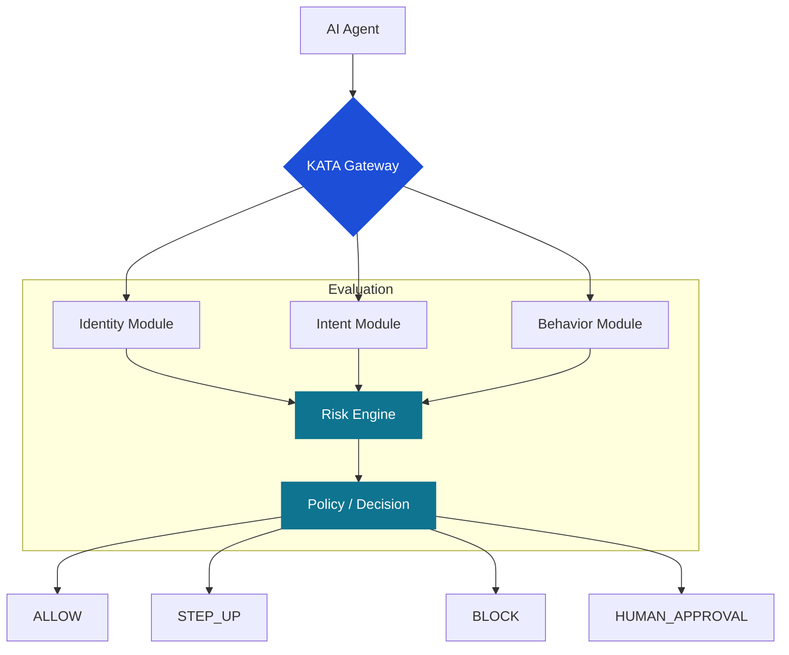

# KATA Architecture

**Status: Concept / Open Design — not production ready.**

This document describes how KATA could be deployed as an infrastructure / service layer: the components, the data flow, and the deployment options. It is a reference architecture, not a product specification.

## Design goal

KATA should sit **between the AI agent and the world it acts on** — evaluating identity, delegation, intent, behavior, and action *before* an action executes, and *continuously* while the agent operates.

## Component overview

| Component | Responsibility |
|---|---|
| **Identity module** | Establishes and validates agent identity and provenance: agent identifier, provider, model, version, deployment environment, cryptographic identity, credentials, and security posture. Consumes evidence from existing identity systems (verifiable credentials, workload identity, OAuth/OIDC). |
| **Intent module** | Parses and stores the principal's structured intent (purpose, limits, constraints, time window, allowed actions). Measures the distance between declared intent and observed action on every evaluation. Detects intent drift over time. |
| **Behavior module** | Maintains the agent's behavioral profile: tool usage patterns, API sequences, velocity, scope changes, retry behavior, infrastructure changes. Flags anomalies as risk signals. |
| **Risk engine** | Correlates signals across all modules into a connected risk graph. Combines component risks (identity, delegation, intent, behavior, action, transaction) into an explainable risk assessment — never just a number. |
| **Policy / decision** | Applies policy rules to the risk assessment and emits one of the seven KATA decisions (`ALLOW`, `ALLOW_WITH_MONITORING`, `STEP_UP`, `HUMAN_APPROVAL`, `BLOCK`, `REVOKE`, `QUARANTINE`). Decisions are machine-readable and explainable: decision + risk score + reasons + required action. |

## Architecture diagram

## Data flow

1. **Intercept.** The agent submits an intended action to the KATA Gateway *before* execution (pre-execution evaluation). Read-only/low-risk actions may be evaluated asynchronously.
2. **Enrich.** The gateway loads the agent's identity record, the active delegation, the structured intent, and recent behavioral history. A verified payment mandate (Verifiable Intent, AP2, or the same shape from another issuer) is one way that delegation and intent evidence arrives. See [interoperability.md](interoperability.md).
3. **Evaluate.** The risk engine correlates the action against identity + delegation + intent + behavior + context, producing component risks and a combined assessment. The action comparison includes price integrity (quote, list, fees, charge) and the counterparty, not only the intent ceiling.
4. **Decide.** Policy maps the assessment to a decision. `ALLOW` proceeds; `STEP_UP` / `HUMAN_APPROVAL` pause for verification; `BLOCK` / `REVOKE` / `QUARANTINE` stop the action and may change the delegation's state. Conceptually, every decision resolves two verdicts: *is this agent legitimate* (identity + delegation + provenance) and *does this action match the grant* (intent + behavior + action vs. authorization).
5. **Record.** Every evaluation — inputs, signals, decision, and rationale — is logged as an auditable trail. This feeds the behavior module for continuous verification.
6. **Re-evaluate.** Outcomes and new risk intelligence trigger re-evaluation of active sessions. Trust is never cached indefinitely.

## API surface (conceptual)

| Endpoint | Purpose |
|---|---|
| `POST /kata/evaluate` | Evaluate a proposed action; returns decision, risk score, reasons, required action |
| `POST /kata/delegations` | Register a machine-readable delegation |
| `DELETE /kata/delegations/{id}` | Revoke a delegation |
| `POST /kata/intents` | Register or update structured intent |
| `GET /kata/sessions/{id}` | Retrieve current trust state and decision history for an agent session |
| `POST /kata/approvals` | Submit a human approval for a `HUMAN_APPROVAL` decision |

Schemas for the core objects live in [`schemas/`](../schemas/).

## Deployment options

- **Gateway (proxy).** KATA terminates or inspects the agent's outbound calls (payments, bookings, API invocations). Strongest enforcement; requires integration at the action boundary.
- **Sidecar.** KATA runs alongside the agent runtime, evaluating actions the agent announces. Easier to adopt; relies on the agent's cooperation (suitable for first-party agents).
- **SDK / library.** Evaluation functions embedded in the agent's own code. Lightest integration; enforcement depends on the host application.

All three are deployment *patterns*, not products. The framework is standards-neutral: it consumes identity and authorization evidence from existing systems rather than replacing them.

## Latency considerations

- **Pre-execution evaluation** is on the critical path: keep the default path fast (cached identity/delegation/intent lookups, local policy), and push deep behavioral analysis to async re-evaluation where possible.
- **Tier the checks (cost discipline).** Cheap signals run on every event (delegation validity, hard intent limits); passive signals (behavioral profiles, reputation) layer on continuously; expensive, high-friction checks (identity re-verification, SIM-swap queries, human approval) fire only at step-up moments. The architecture follows the cost curve.
- **Fail closed vs. fail open** is a policy decision, not an architectural one: critical actions (payments, transfers) should fail closed on evaluation errors; informational actions may fail open with monitoring.

## Out of scope for this document

Concrete wire protocols, SDK implementations, storage design, and multi-tenant isolation are deliberately left open for future design and community input.
