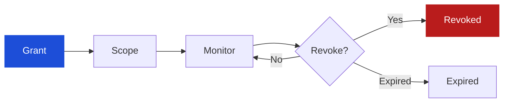

# KATA Delegation Model

**Status: Concept / Open Design — not production ready.**

Delegation is the explicit, machine-readable relationship between a **principal** (human, business, institution, system, or another agent) and an **agent** — the answer to *"who authorized this agent, to do what, for how long, under what conditions?"*

## Delegation lifecycle



1. **Grant.** The principal issues a delegation: to which agent, for what purpose, with what limits. Grants should be explicit — never inferred from ambient authority.
2. **Scope.** The delegation binds to structured intent(s) and constraints: amounts, merchants, time windows, allowed actions.
3. **Monitor.** Every action under the delegation is evaluated by KATA (see [risk-model.md](risk-model.md)). Behavior, intent distance, and validity are checked continuously.
4. **Revoke / expire.** The principal — or policy, on the principal's behalf — can revoke at any time. Delegations should be short-lived by default; expiry is a safety net, not the primary control.

## Machine-readable delegation fields

| Field | Type | Description |
|---|---|---|
| `delegation_id` | string | Unique identifier. |
| `principal` | object | `{ type: human\|business\|institution\|system\|agent, id }` — who granted authority. |
| `agent` | object | `{ agent_id, ... }` — to whom authority was granted. |
| `granted_at` | string (datetime) | When the delegation was issued. |
| `expires_at` | string (datetime) | When it lapses. Short-lived by default. |
| `purpose` | string | Human-readable purpose of the delegation. |
| `scope` | object | Machine-readable limits: intents bound, amount ceilings, allowed action verbs, resource constraints. |
| `conditions` | array | Conditions that must hold (e.g., `business_hours_only`, `principal_present`, `max_risk_score`). |
| `revocable` | boolean | Whether the principal can revoke (default: true). |
| `revocation_endpoint` | string | Where revocation is published/checked. |
| `delegation_chain` | array | For agent-to-agent delegation: the chain of delegations from the root principal. |
| `status` | string | `active` \| `suspended` \| `revoked` \| `expired`. |

The normative schema draft is [`schemas/delegation.json`](../schemas/delegation.json).

## Expiry

- Prefer **short-lived delegations** (minutes to hours for interactive tasks; bounded windows for standing tasks).
- Expiry must be **enforced at evaluation time**, not just at issuance — a stale delegation cache is a vulnerability (see [threat-model.md](threat-model.md): revocation failure).
- Renewal is a new grant, not a silent extension: it should re-confirm scope with the principal or with policy acting on their behalf.

## Conditions

Conditions make delegation **contextual**, not just scoped:

```json
"conditions": [
  { "type": "time_window", "start": "09:00", "end": "17:00", "timezone": "America/Halifax" },
  { "type": "max_risk_score", "value": 60 },
  { "type": "merchant_allowlist", "merchants": ["acme-travel.example"] }
]
```

If a condition stops holding mid-session, the delegation is effectively suspended until conditions are met again or the principal re-grants.

## Revocability

- **Revocation must propagate fast.** `DELETE /kata/delegations/{id}` (conceptual) should be checked on every evaluation — or delegations should be short-lived enough that propagation delay is bounded.
- Revocation is a first-class **decision** (`REVOKE`), not just an administrative action: KATA can revoke a delegation itself when risk demands it (e.g., detected compromise).
- Revoked delegations invalidate bound intents and active sessions. Partial revocation (narrowing scope) is preferable to full revocation where the model supports it.

## Delegation chains (agent-to-agent)

When an agent delegates to a sub-agent:

- The sub-delegation **cannot exceed** the parent's scope (no privilege amplification down the chain).
- The full chain from the root principal must be verifiable at evaluation time.
- Each link records who delegated to whom, when, and under what narrowed scope.
- A break or revocation anywhere in the chain invalidates everything below it.

## Evidence from payment mandates

An open Verifiable Intent or AP2 mandate is delegation evidence: a user key (or trusted-surface key) confirms the agent key (`cnf`), `exp` bounds the grant, and the constraint set is the scope. KATA still monitors every later action and can `REVOKE` the grant. Constraint checking inside those protocols is not a KATA decision. Field mapping: [interoperability.md](interoperability.md).

## Least-privilege guidance

- Grant the **narrowest scope** that lets the task succeed: specific purpose, amount ceiling, merchant constraints, time window, allowed verbs.
- Separate delegations for separate tasks rather than one broad delegation.
- Treat "the agent needs standing access" as a smell — prefer per-task delegations with renewal.
- Standing or high-privilege delegations (e.g., access to investment accounts) should require `HUMAN_APPROVAL` at grant time and re-confirmation periodically.
